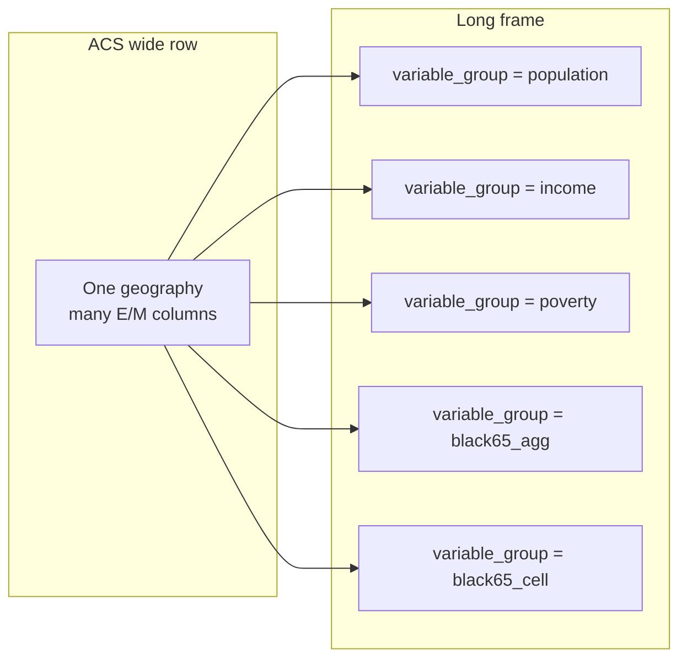

# ACS data shape diagram — wide rows vs variable groups

Plain-English picture of how our ACS pull is stored, and how EDA 07 reshapes it
into a **long** analysis frame with a `variable_group` column.

Numbers below are **illustrative teaching examples** (rounded, not a specific
live extract). Real NJ counts live in `data/raw/acs5_2024_nj_*.parquet` and are
reshaped by [`analysis/cv_model.py`](../analysis/cv_model.py).

Related: [`data-dictionary.md`](data-dictionary.md) · [`glossary.md`](glossary.md)
(place population vs estimate size) · [`notebooks/07-cv-driver-model.ipynb`](../notebooks/07-cv-driver-model.ipynb).

---

## 1. How ACS stores it (wide — one geography per row)

Each geography is **one row**. Many estimate (`_E`) and MOE (`_M`) columns sit
side by side. That is the shape written by [`ingestion/pull_acs_nj.py`](../ingestion/pull_acs_nj.py).

```text
ONE GEOGRAPHY (e.g. one tract)  →  ONE ROW
┌─────────────────────────────────────────────────────────────────────────┐
│ STATE, COUNTY, TRACT, NAME                                              │
│ B01003_001E / B01003_001M     ← total population                        │
│ B19013_001E / B19013_001M     ← median household income                 │
│ B17001_002E / B17001_002M     ← people below poverty                    │
│ B01001B_014E…_031E / _M       ← six Black 65+ age×sex cells             │
└─────────────────────────────────────────────────────────────────────────┘
```

**Key idea:** the Census table is *place × many variables*. `variable_group` is
**not** a Census field — we invent it when we melt the row for modeling.

### Availability by geography level (this project’s pull)

| Variable group | County | Tract | Block group |
|----------------|:------:|:-----:|:-----------:|
| population (`B01003`) | yes | yes | yes |
| income (`B19013`) | yes | yes | yes |
| poverty (`B17001`) | yes | yes | **no** (null / not used) |
| Black 65+ cells / aggregate (`B01001B`) | yes | yes | **no** (null / not used) |

NJ counts in this project: **21 counties · 2,181 tracts · 6,599 block groups**.

---

## 2. How EDA 07 uses it (long — one variable group per row)

The same place becomes **several rows**. Each row answers one question and
carries its own `estimate_size` and `cv`.

```text
WIDE (1 row)                         LONG (many rows)
─────────────────                    ────────────────────────────────────
Tract 1234  all cols   ──melt──►     Tract 1234 | population   | size | cv
                                     Tract 1234 | income       | size | cv
                                     Tract 1234 | poverty      | size | cv
                                     Tract 1234 | black65_agg  | size | cv
                                     Tract 1234 | black65_cell | size | cv  (×6 cells)
```



### What goes in each long-row column

| Column | Meaning |
|--------|---------|
| `level` | `county` / `tract` / `block_group` |
| `variable_group` | Which estimate this row is about (see §3) |
| `place_pop` | Total population of the place (`B01003_001E`) — same for every group at that place |
| `estimate_size` | Size of *this* estimate: the count itself, or **households** for income (never the dollar median) |
| `cv` | Coefficient of variation for *this* estimate |

---

## 3. Examples at each geography level

Same story at three zooms. Notice: **`place_pop` is shared**; **`estimate_size` and `cv` change by variable group**.

### 3a. County example (illustrative)

Wide mental model: one county row holds all columns.

Long frame after reshape:

| level | place (example) | variable_group | place_pop | estimate_size | cv | What the row means |
|-------|-----------------|----------------|----------:|--------------:|-----:|--------------------|
| county | Atlantic County | population | 275,000 | 275,000 people | 0.01 | How many people live here? |
| county | Atlantic County | income | 275,000 | 105,000 households | 0.02 | What’s median HH income? |
| county | Atlantic County | poverty | 275,000 | 32,000 people | 0.05 | How many people in poverty? |
| county | Atlantic County | black65_agg | 275,000 | 8,500 people | 0.08 | How many Black adults 65+? |
| county | Atlantic County | black65_cell | 275,000 | 1,200 people | 0.18 | e.g. Black males 65–74 only |

Counties are large → CVs tend to be small. All five variable groups exist.

### 3b. Tract example (illustrative)

| level | place (example) | variable_group | place_pop | estimate_size | cv | What the row means |
|-------|-----------------|----------------|----------:|--------------:|-----:|--------------------|
| tract | Tract 1, Atlantic Co. | population | 4,200 | 4,200 people | 0.08 | Total population |
| tract | Tract 1, Atlantic Co. | income | 4,200 | 1,500 households | 0.12 | Median income (size = HH) |
| tract | Tract 1, Atlantic Co. | poverty | 4,200 | 380 people | 0.35 | Poverty count |
| tract | Tract 1, Atlantic Co. | black65_agg | 4,200 | 95 people | 0.55 | Black 65+ combined |
| tract | Tract 1, Atlantic Co. | black65_cell | 4,200 | 12 people | 0.90 | One detailed age×sex cell |

Same tract, five (or more) long rows. The small Black 65+ cell has a **tiny**
`estimate_size` even though `place_pop` is 4,200 — that is why its CV is high.

### 3c. Block group example (illustrative)

Poverty and Black 65+ tables are **not usable at block group** in this pull
(values are null). Only population and income enter the long frame.

| level | place (example) | variable_group | place_pop | estimate_size | cv | What the row means |
|-------|-----------------|----------------|----------:|--------------:|-----:|--------------------|
| block_group | BG 1; Tract 1; Atlantic Co. | population | 980 | 980 people | 0.15 | Total population |
| block_group | BG 1; Tract 1; Atlantic Co. | income | 980 | 340 households | 0.22 | Median income (size = HH) |
| block_group | BG 1; Tract 1; Atlantic Co. | poverty | — | — | — | **Not in model** (table floor = tract) |
| block_group | BG 1; Tract 1; Atlantic Co. | black65_agg | — | — | — | **Not in model** (table floor = tract) |
| block_group | BG 1; Tract 1; Atlantic Co. | black65_cell | — | — | — | **Not in model** (table floor = tract) |

```text
County  ──has──►  population, income, poverty, black65_*
Tract   ──has──►  population, income, poverty, black65_*
Block group ──has──►  population, income only
                      (poverty / Black 65+ stop at tract)
```

---

## Why this reshape matters

- Modeling `log(CV) ~ log(place_pop)` on a **pooled** long frame mixes easy
  population rows with hard subgroup rows → R² near zero (JL notebook 04 /
  EDA 07 baseline A).
- Adding `variable_group` (and especially `estimate_size`) lets the model
  separate “this place is big” from “this *estimate* is small.”
- The composite score (EDA 06) still usually picks **one** variable at a time
  for the map (e.g. income). The long frame is for **understanding drivers**,
  not for putting five CVs in one dashboard cell.

---

## Variable-group cheat sheet

| `variable_group` | ACS codes | `estimate_size` source |
|------------------|-----------|-------------------------|
| `population` | `B01003_001` | population count |
| `income` | `B19013_001` | household universe `B99192_001E` (allocation pull) |
| `poverty` | `B17001_002` | poverty count |
| `black65_agg` | sum of six `B01001B_*` | combined count (handbook zero-cell MOE) |
| `black65_cell` | each `B01001B_*` alone | that cell’s count |
